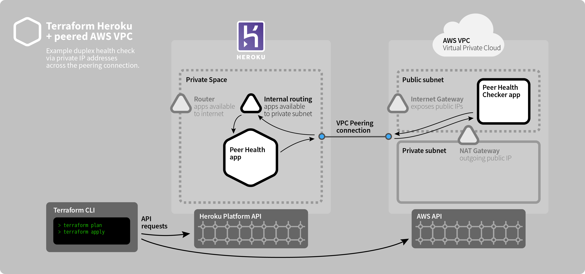

# AWS VPC with Redshift peered with a Heroku Private Space

Based off of the [mars/terraform-aws-vpc-peered project](https://github.com/mars/terraform-aws-vpc-peered). 

This example provisions an AWS VPC via the [mars/heroku_aws_vpc](https://github.com/mars/terraform-aws-vpc) module, a new Private Space, peers them automatically and provisions a Redshift cluster in the AWS VPC which heroku apps can connect to without traversing the public internet.



## Requirements

1. A Heroku Enterprise Account
1. An [AWS IAM](https://console.aws.amazon.com/iam/home) user (`aws_access_key` & `aws_secret_key` in Usage below).

Name suggestion: `terraform-vpc-peered-health-provisioner`

With policies:
* **AmazonEC2FullAccess**
* **AmazonECS_FullAccess**
* **AmazonVPCFullAccess**
* **IAMFullAccess**
* **CloudWatchLogsFullAccess**
* **AmazonRedshiftFullAccess**

## Usage

```bash
export \
  TF_VAR_heroku_email=name@example.com \
  TF_VAR_heroku_enterprise_team=xxxxx \
  TF_VAR_heroku_api_key=xxxxx \
  TF_VAR_aws_access_key=xxxxx \
  TF_VAR_aws_secret_key=xxxxx \
  TF_VAR_instance_public_key='ssh-rsa xxxxx…' 

terraform init

terraform apply \
  -var name=my-deployment-name \
  -var aws_region=us-west-2
```

Note: Make sure "your-deployment-name" is less than 30 characters long. 

